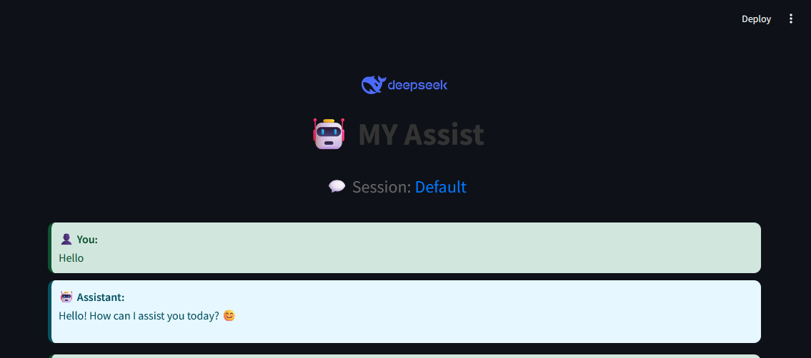

## MY Assist : A Chat deepseek UI
A simple web-based chat interface powered by Ollama's deep-seek model.
This tool provides an interactive, real-time chatting experience with the
assistant, using Streamlit for the frontend. The assistant processes and streams
responses back to the user, ensuring a seamless and engaging interaction.



## Features
- **Completely Local, Admin role not needed**: The solution is complately local and Admin rights not needed, internet connection only needed for first time install and udpating models.
- **Real-time Chat Interface**: Allows for dynamic interaction with the assistant.
- **Persistent Chat History**: Maintains chat history between sessions.
- **Save & Load Chat History**: Automatically saves chat history to a SQLLite DB for persistent conversations.
- **Take Backup of the DB as required**: The complete sessions and chat can be backed up by downloading the backup file to a cloud storage.
- **Restore Backup**: Use the file you have saved in cloud storage and restore chat history.

### Setup

Install [ollama](https://ollama.com/download)

Pull deepseek-r1 model

```sh
ollama pull deepseek-r1 
```

Clone repo
```sh
git clone https://github.com/ductnn/chat-deepseek-ui.git
cd chat-deepseek-ui
```

Build postgres database and redis:
```sh
# Use docker-compose
docker-compose up -d
```

Install required packages:
```sh
pip install streamlit ollama
```

If you still get build errors in package `pyarrow`, try installing `pyarrow`
as a binary:
```sh
pip install --only-binary=:all: pyarrow
```

Run the app:
```sh
run.bat
or
streamlit run app.py
```

Inspired By and Thanks to https://github.com/ductnn/chat-deepseek-ui.git

